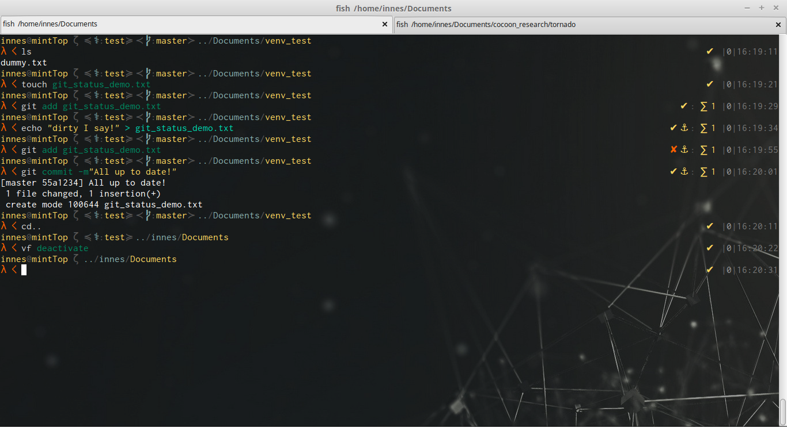

# It's All Greek To Me!

"It's All Greek To Me!" Is a fish shell prompt that is aware of:
* git status
* python virtual envs
* [soon to be] docker (if I can get past needing sudo all the time!)

Install through the [fisherman](https://github.com/fisherman/fisherman/) plugin manager or by simply overwriting the fish_prompt.fish and fish_right_prompt.fish files in your fish config folder.
